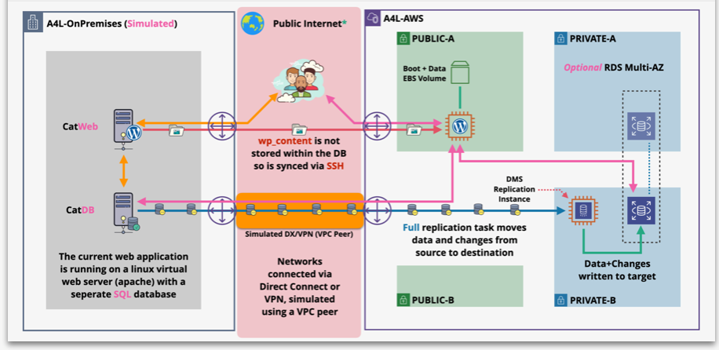

# Migrating a database with the Database Migration Service

You will be migrating a simple web application (wordpress) from an on-premises environment into AWS.  
The on-premises environment is a virtual web server (simulated using EC2) and a self-managed mariaDB database server (also simulated via EC2)  
You will be migrating this into AWS and running the architecture on an EC2 webserver and RDS managed SQL database using AWS Cloudformation Service.. 
- [Database-AutoMigration-Template](https://github.com/mehmetafsar510/aws_devops/blob/master/aws/projects/007-database-migration-service/DatabaseAutoMigrationService.yaml)

We have 6 stages :-

- STAGE 1 : Provision the environment and review tasks
- STAGE 2 : Establish Private Connectivity Between the environments (VPC Peer)
- STAGE 3 : Create & Configure the AWS Side infrastructure (App and DB)
- STAGE 4 : Migrate Database & Cutover
- STAGE 5 : Cleanup the account

