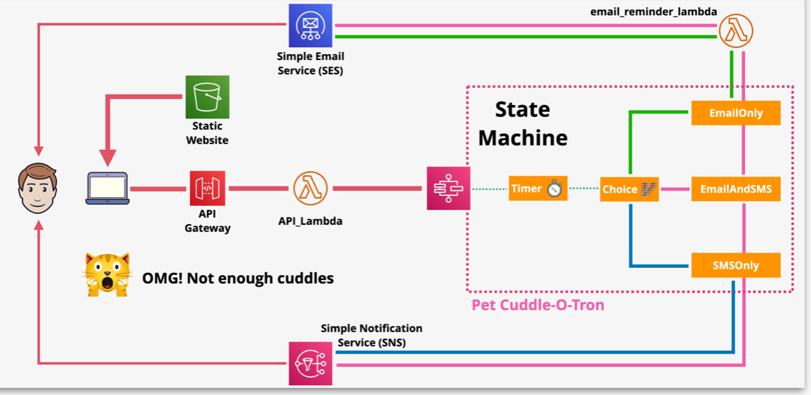

# Serverless App 

We are going to implement a simple serverless application using S3, API Gateway, Lambda, Step Functions, SNS & SES with using Aws Cloudformation service.

- [Serverless Cloudformation Template](https://github.com/mehmetafsar510/aws_devops/blob/master/aws/projects/008-serverless/serveslessyaml.yml)

Thia consists of 5 stages :-

- STAGE 1 : Configure Simple Email service 
- STAGE 2 : Add a email lambda function to use SES to send emails for the serverless application 
- STAGE 3 : Implement and configure the state machine, the core of the application
- STAGE 4 : Implement the API Gateway, API and supporting lambda function
- STAGE 5 : Implement the static frontend application and test functionality

