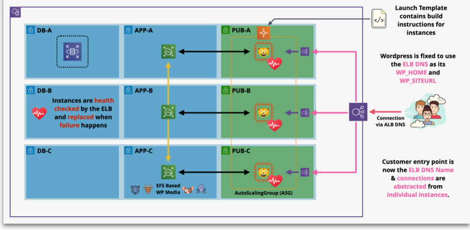

# Web App - Single Server to Elastic Evolution

You are going to evolve the architecture of a popular web application wordpress
You are going to create a launch template which can automate the build of WordPress. Than  you will be creating an EFS file system designed to store the wordpress locally stored media. This area stores any media for posts uploaded when creating the post as well as theme data.  By storing this on a shared file system it means that the data can be used across all instances in a consistent way, and it lives on past the lifetime of the instance. Than you will be adding an auto scaling group to provision and terminate instances automatically based on load on the system.  
The architecture will still use the single instance for both the WordPress application and database using Aws Cloudformation template.

- [WepApp Template](https://github.com/mehmetafsar510/aws_devops/blob/master/aws/projects/009-aws-elastic-wordpress-evolution/ASG-ELB-EFS-RDSdenemeson.yaml)

The demo consists of 7 stages, each implementing additional components of the architecture  

- Stage 1 - Setup the environment and manually build wordpress  
- Stage 2 - Automate the build using a Launch Template  
- Stage 3 - Split out the DB into RDS and Update the LT 
- Stage 4 - Split out the WP filesystem into EFS and Update the LT
- Stage 5 - Enable elasticity via a ASG & ALB and fix wordpress (hardcoded WPHOME)

