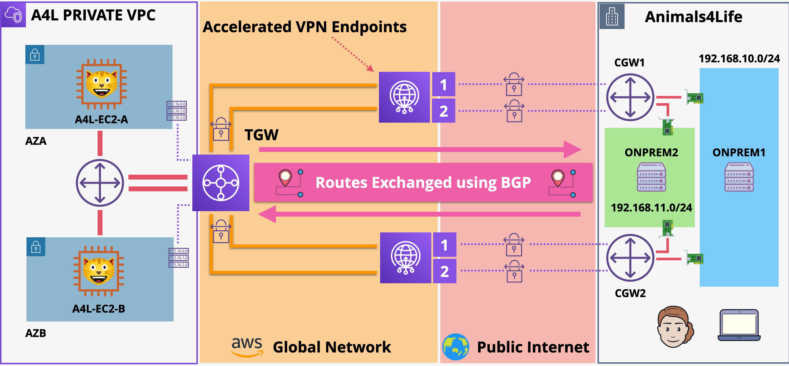

# Highly-Available Dynamic Site-to-Site VPN

I will demonstrate how to integrate an on-premises network with AWS networks via AWS site-to-site VPN connections and either AWS Virtual Private Gateways (VGWs) or AWS Transit Gateways (TGWs) using AWS Cloudformation Service.

# INITIAL SETUP OF AWS ENVIRONMENT AND SIMULATED ON-PREMISES ENVIRONMENT

- Apply `AWS-VPN.yaml` [AWS-VPN](https://github.com/mehmetafsar510/aws_devops/blob/master/aws/projects/010-Dynamic-site-site-vpnconnection/AWS-VPN.yaml) to the `us-east-1` region in your AWS account (Call it AWS) - If prompted ... check capabilities Box
- Apply `ONPREM-VPN.yaml` [ONPREM-VPN](https://github.com/mehmetafsar510/aws_devops/blob/master/aws/projects/010-Dynamic-site-site-vpnconnection/ONPREM-VPN.yaml)  to the `us-east-1` region in your AWS account (Call it OMPREM) - If prompted ... check capabilities Box

Wait for both stacks to move into a `CREATE_COMPLETE` status **Estimated time to complete 5-10 mins**

# CONFIGURE IPSEC TUNNELS FOR ONPREMISES-ROUTER1

BEFORE DOING THIS STAGE
BOTH VPN CONNECTIONS
Wait for `State` to change from `pending` to `available` for both attachments
~ 15 minutes

Move to EC2 Console
https://console.aws.amazon.com/ec2/v2/home?region=us-east-1#Instances:sort=instanceState
Click `Instances` on the left menu
Locate and select `ONPREM-ROUTER1`
Right Click => `Connect`
Select `Session Manager`
Click `Connect`
`sudo bash`
`cd /home/ubuntu/demo_assets/`
`nano ipsec.conf`

This is is the file which configures the IPSEC Tunnel interfaces over which our VPN traffic flows.
This configures the ones for ROUTER1 -> BOTH AWS Endpoints

Replace the following placeholders with the real values in the `DemoValueTemplate.md`(you have change your own configuration. Download it vpn connection part than change this value) document

- ROUTER1_PRIVATE_IP
- CONN1_TUNNEL1_ONPREM_OUTSIDE_IP
- CONN1_TUNNEL1_AWS_OUTSIDE_IP
- CONN1_TUNNEL1_AWS_OUTSIDE_IP
and
- ROUTER1_PRIVATE_IP
- CONN1_TUNNEL2_ONPREM_OUTSIDE_IP
- CONN1_TUNNEL2_AWS_OUTSIDE_IP
- CONN1_TUNNEL2_AWS_OUTSIDE_IP

`ctrl+o` to save and `ctrl+x` to exit

`nano ipsec.secrets`

This file controls authentication for the tunnels
Replace the following placeholders with the real values in the `DemoValueTemplate.md` document

- CONN1_TUNNEL1_ONPREM_OUTSIDE_IP
- CONN1_TUNNEL1_AWS_OUTSIDE_IP
- CONN1_TUNNEL1_PresharedKey
and
- CONN1_TUNNEL2_ONPREM_OUTSIDE_IP
- CONN1_TUNNEL2_AWS_OUTSIDE_IP
- CONN1_TUNNEL2_PresharedKey

`Ctrl+o` to save
`Ctrl+x` to exit

`nano ipsec-vti.sh`

This script brings UP the tunnel interfaces when needed
Replace the following placeholders with the real values in the `DemoValueTemplate.md` document

- CONN1_TUNNEL1_ONPREM_INSIDE_IP  (ensuring the /30 is at the end)
- CONN1_TUNNEL1_AWS_INSIDE_IP (ensuring the /30 is at the end)
- CONN1_TUNNEL2_ONPREM_INSIDE_IP (ensuring the /30 is at the end)
- CONN1_TUNNEL2_AWS_INSIDE_IP (ensuring the /30 is at the end)

`Ctrl+o` to save
`Ctrl+x` to exit

`cp ipsec.conf /etc`
`cp ipsec.secrets /etc`
`cp ipsec-vti.sh /etc`
`chmod +x /etc/ipsec-vti.sh`

`systemctl restart strongswan` to restart strongswan ... this should bring up the tunnels

# CONFIGURE IPSEC TUNNELS FOR ONPREMISES-ROUTER2

(YOU WILL NEED THE CONNECTION2CONFIG.TXT) File you saved earlier

Move to EC2 Console
https://console.aws.amazon.com/ec2/v2/home?region=us-east-1#Instances:sort=instanceState
Click `Instances` on the left menu
Locate and select `ONPREM-ROUTER1`
Right Click => `Connect`
Select `Session Manager`
Click `Connect`

`sudo bash`
`cd /home/ubuntu/demo_assets/`
`nano ipsec.conf`

This is is the file which configures the IPSEC Tunnel interfaces over which our VPN traffic flows.
This configures the ones for ROUTER1 -> BOTH AWS Endpoints

Replace the following placeholders with the real values in the `DemoValueTemplate.md` document

- ROUTER2_PRIVATE_IP
- CONN2_TUNNEL1_ONPREM_OUTSIDE_IP
- CONN2_TUNNEL1_AWS_OUTSIDE_IP
- CONN2_TUNNEL1_AWS_OUTSIDE_IP
and
- ROUTER2_PRIVATE_IP
- CONN2_TUNNEL2_ONPREM_OUTSIDE_IP
- CONN2_TUNNEL2_AWS_OUTSIDE_IP
- CONN2_TUNNEL2_AWS_OUTSIDE_IP

`ctrl+o` to save and `ctrl+x` to exit

`nano ipsec.secrets`

This file controls authentication for the tunnels
Replace the following placeholders with the real values in the `DemoValueTemplate.md` document

- CONN2_TUNNEL1_ONPREM_OUTSIDE_IP
- CONN2_TUNNEL1_AWS_OUTSIDE_IP
- CONN2_TUNNEL1_PresharedKey
and
- CONN2_TUNNEL2_ONPREM_OUTSIDE_IP
- CONN2_TUNNEL2_AWS_OUTSIDE_IP
- CONN2_TUNNEL2_PresharedKey

`Ctrl+o` to save
`Ctrl+x` to exit

`nano ipsec-vti.sh`

This script brings UP the tunnel interfaces when needed
Replace the following placeholders with the real values in the `DemoValueTemplate.md` document

- CONN2_TUNNEL1_ONPREM_INSIDE_IP  (ensuring the /30 is at the end)
- CONN2_TUNNEL1_AWS_INSIDE_IP (ensuring the /30 is at the end)
- CONN2_TUNNEL2_ONPREM_INSIDE_IP (ensuring the /30 is at the end)
- CONN2_TUNNEL2_AWS_INSIDE_IP (ensuring the /30 is at the end)

`Ctrl+o` to save
`Ctrl+x` to exit

`cp ipsec* /etc`
`chmod +x /etc/ipsec-vti.sh`

`systemctl restart strongswan` to restart strongswan ... this should bring up the tunnels

# CONFIGURE BGP ROUTING FOR ONPREMISES-ROUTER1 AND TEST

Move to EC2 Console
https://console.aws.amazon.com/ec2/v2/home?region=us-east-1#Instances:sort=instanceState
Click `Instances` on the left menu
Locate and select `ONPREM-ROUTER1`
Right Click => `Connect`
Select `Session Manager`
Click `Connect`

`chmod +x ffrouting-install.sh`
`./ffrouting-install.sh`

`vtysh`
`conf t`
`frr defaults traditional`
`router bgp 65016`
`neighbor CONN1_TUNNEL1_AWS_BGP_IP remote-as 64512`
`neighbor CONN1_TUNNEL2_AWS_BGP_IP remote-as 64512`
`no bgp ebgp-requires-policy`
`address-family ipv4 unicast`
`redistribute connected`
`exit-address-family`
`exit`
`exit`
`wr`
`exit`

`sudo reboot`

SHOW THE ROUTES VIA THE UI
SHOW THE ROUTES VIA `vtysh`

Move to EC2 Console
https://console.aws.amazon.com/ec2/v2/home?region=us-east-1#Instances:sort=instanceState
Click `Instances` on the left menu
Locate and select `ONPREM-SERVER1`
Right Click => `Connect`
Select `Session Manager`
Click `Connect`

run `ping IP_ADDRESS_OF_EC2-A`

Move to EC2 Console
https://console.aws.amazon.com/ec2/v2/home?region=us-east-1#Instances:sort=instanceState
Click `Instances` on the left menu
Locate and select `EC2-A`
Right Click => `Connect`
Select `Session Manager`
Click `Connect`

run `ping IP_ADDRESS_OF_ONPREM-SERVER1`

# CONFIGURE BGP ROUTING FOR ONPREMISES-ROUTER2 AND TEST

Move to EC2 Console
https://console.aws.amazon.com/ec2/v2/home?region=us-east-1#Instances:sort=instanceState
Click `Instances` on the left menu
Locate and select `ONPREM-ROUTER2`
Right Click => `Connect`
Select `Session Manager`
Click `Connect`

`chmod +x ffrouting-install.sh`
`./ffrouting-install.sh`

`vtysh`
`conf t`
`frr defaults traditional`
`router bgp 65016`
`neighbor CONN2_TUNNEL1_AWS_BGP_IP remote-as 64512`
`neighbor CONN2_TUNNEL2_AWS_BGP_IP remote-as 64512`
`no bgp ebgp-requires-policy`
`address-family ipv4 unicast`
`redistribute connected`
`exit-address-family`
`exit`
`exit`
`wr`
`exit`

`sudo reboot`

SHOW THE ROUTES VIA THE UI
SHOW THE ROUTES VIA `vtysh`

Move to EC2 Console
https://console.aws.amazon.com/ec2/v2/home?region=us-east-1#Instances:sort=instanceState
Click `Instances` on the left menu
Locate and select `ONPREM-SERVER2`
Right Click => `Connect`
Select `Session Manager`
Click `Connect`

run `ping IP_ADDRESS_OF_EC2-B`

Move to EC2 Console
https://console.aws.amazon.com/ec2/v2/home?region=us-east-1#Instances:sort=instanceState
Click `Instances` on the left menu
Locate and select `EC2-B`
Right Click => `Connect`
Select `Session Manager`
Click `Connect`

run `ping IP_ADDRESS_OF_ONPREM-SERVER2`

# CLEANUP
- Delete the ONPREM STACK
- Delete the AWS Stack

