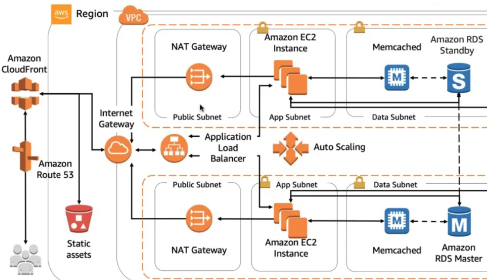

# Project-502 : Phonebook Application (Python Flask) deployed on AWS Application Load Balancer with Auto Scaling,  Relational Database Service(RDS), VPC's Components and Cloudfront with Route 53 using AWS Cloudformation

## Description

The Phonebook Application aims to deploye phonebook application in Python as a web application with Flask on AWS Application Load Balancer with Auto Scaling Group of Elastic Compute Cloud (EC2) Instances and Relational Database Service (RDS) on defined VPC. The Cloudfront and Route 53 services are located in front of the architecture and manage the traffic. In addition, this architecture will be deployed using AWS Cloudformation Service.

## Problem Statement



- Your company has recently started a project that aims to serve as phonebook web application on isolated VPC environment. You and your colleagues have started to work on the project. Your teammates have developed the UI part the project as shown in the template folder and they need your help to develop the coding part and deploying the app in development environment.

- As a first step, you need to write program that creates a phonebook, adds requested contacts to the phonebook, finds and removes the contacts from the phonebook.

- Application is coded by development team and given you as DevOps team. should allow users to search, add, update and delete the phonebook records and the phonebook records should be kept in separate MySQL database in AWS RDS service. 

- As a second step, The web application will be deployed using Python's Flask framework.

- All you need for web application that `index.html`, `add-update.html` and `delete.html` are within the `templates` folder. The Web Application should be accessible via web browser from anywhere.

- You are requested to push your program to the project repository on the Github and to pull it into the webservers in the development environment on AWS Cloud using AWS Cloudformation Service to showcase your project. 

In the architecture, you can configure your Cloudformation template using the followings,

  - The application stack should be created with new AWS resources.

  - Specifications of VPC:

    - VPC has two AZ and every AZ has 1 public and 1 private subnets.

    - VPC has Internet Gateway

    - Every AZ has NAT Gateway

    - There should be managed private and public route tables.

    - There should be arranged routing policies and subnet associations based on public and private subnets.

  - Template should create Application Load Balancer with Auto Scaling Group of Amazon Linux 2 EC2 Instances within created VPC.

  - Template should create RDS instance within private subnets on created VPC.

  - Application Load Balancer should be placed within a security group which allows HTTP (80) connections from anywhere.

  - EC2 instances should be placed within a different security group which allows HTTP (80) and SSH (22) connections only from the security group of Application Load Balancer.

  - The Auto Scaling Group should use a Launch Template in order to launch instances needed and should be configured to;

    - use all Availability Zones.

    - set desired capacity of instances to `2`

    - set minimum size of instances to `1`

    - set maximum size of instances to `3`

    - set health check grace period to `90 seconds`

    - set health check type to `ELB`

  - The Launch Template should be configured to;

    - prepare Python Flask environment on EC2 instance,

    - download the Phonebook Application code from Github repository,

    - deploy the application on Flask Server.

  - EC2 Instances type can be configured as `t2.micro`.

  - Instance launched by Cloudformation should be tagged `Web Server of StackName`

  - For RDS Database Instance;
  
    - Instance type can be configured as `db.t2.micro`

    - Database engine can be `MySQL` with version of `8.0.20`.

  - Cloudfront should be set as a cache server which points to Application Load Balance with following configurations;

    - The cloudfront distribution should be connected to the full domain name of the application.

    - The cloudfront distribution should communicate with ALB securely.

    - HTTP version 2 should be employed.

  - As cache behavior;

    - GET, HEAD, OPTIONS, PUT, POST, PATCH, DELETE methods should be allowed.

    - Cookies should not be forwarded to bucket.

    - Newly created ACM Certificate should be used for securing connections.

    - Within Route 53 a record set should be configured to send requests to the Cloudfront distribution.


  - After the stack created, following outputs should be given;

    - Endpoint for Phonebook Cloudfront Distribution

    - Name of ALB DNS Name
    
    - Phonebook Application Website URL should be given as output by Cloudformation Service, after the stack created.


## Project Skeleton 

```text
004-phonebook-web-application (folder)
|
|----readme.md         # Given to the students (Definition of the project)
|----cfn-rds-elb-asg-vpc-template.yml   # To be delivered by students (Cloudformation template)
|----app.py            # Given to the students (Python Flask Web Application)
|----templates
        |----index.html      # Given to the students (HTML template)
        |----add-update.html # Given to the students (HTML template)
        |----delete.html     # Given to the students (HTML template)
```

## Expected Outcome


### At the end of the project, following topics are to be covered;

- Bash scripting

- AWS EC2 Launch Template Configuration

- AWS VPC Configuration
  - VPC
  - Private and Public Subnets
  - Private and Public Route Tables
  - Managing routes
  - Subnet Associations
  - Internet Gateway
  - NAT Gateway
  - Bastion Host

- AWS EC2 Application Load Balancer Configuration

- AWS EC2 ALB Target Group Configuration

- AWS EC2 ALB Listener Configuration

- AWS EC2 Auto Scaling Group Configuration

- AWS Relational Database Service Configuration

- AWS EC2, RDS, ALB Security Groups Configuration;

- AWS Cloudformation Service

- AWS Cloudformation Template Design

- Git & Github for Version Control System

### At the end of the project, students will be able to;

- construct VPC environment with whole components like public and private subnets, route tables and managing their routes, internet Gateway, NAT Gateway. 

- apply web programming skills using HTTP GET/POST methods, template formatting, importing packages within Python Flask Framework

- configure connection to the `MySQL` database.

- work with a database using the SQL within Flask application.

- demonstrate bash scripting skills using `user data` section within launch template in Cloudformation to install and setup web application on EC2 Instance.

- demonstrate their configuration skills of AWS EC2 Launch Templates, Application Load Balancer, ALB Target Group, ALB Listener, Auto Scaling Group, RDS and Security Groups.

- configure Cloudformation template to use AWS Resources.

- show how to use AWS Cloudformation Service to launch stacks.

- apply git commands (push, pull, commit, add etc.) and Github as Version Control System.

## Steps to Solution
  
- Step 1: Download or clone project definition from `clarusway` repo on Github 

- Step 2: Create project folder for local public repo on your pc 

- Step 3: Prepare a cloudformation template to deploy your app on Application Load Balancer together with RDS on created VPC

- Step 4: Push your application into your own public repo on Github

- Step 5: Deploy your application on AWS Cloud using Cloudformation template to showcase your app

## Notes

- Customize the application by hard-coding your name for the `developer_name` variable within html templates.

- RDS database should be located in private subnet. just EC2 machines that has ALB security group can talk with RDS.

- Following list will be taken from user as parameter;
  - CIDR blocks of VPC and Subnets 
  - Keyname
  - instance type
  - Domain name and subdomain

- Image Id (AMI) will be mapped by templates.


## Resources

- [Python Flask Framework](https://flask.palletsprojects.com/en/1.1.x/quickstart/)

- [Python Flask Example](https://realpython.com/flask-by-example-part-1-project-setup/)

- [AWS Cloudformation User Guide](https://docs.aws.amazon.com/AWSCloudFormation/latest/UserGuide/Welcome.html)

- [AWS CLI Command Reference](https://docs.aws.amazon.com/cli/latest/index.html)
