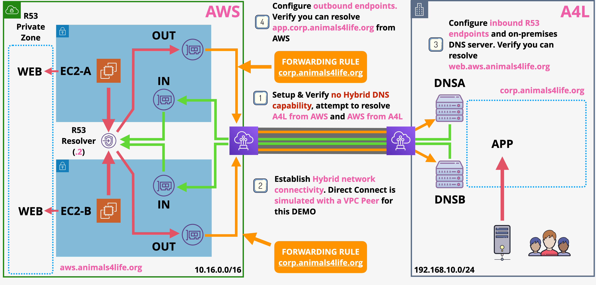

# Hybrid Directory between AWS and Simulated On-Premises

You will get the chance to experience how to integrate the DNS platforms of AWS and a linux based, simulated on-premises environment using Route53 inbound and outbound endpoints using AWS Cloudformation service.

[HybridDNS-Template](https://github.com/mehmetafsar510/aws_devops/blob/master/aws/projects/012-hybrid-dns-endstate/HybridDNS.yaml)

# APPLY CloudFormation (CFN) Stack  

Click [HybridDNS-Template]() and upload this template.

Check the box for `capabilities: [AWS::IAM::Role]`
Click `Create Stack`

The stack will take 5-10 minutes to apply and will need to be in a `CREATE_COMPLETE` state before you can continue. 

# Update the App server DNS

Load the EC2 Console https://console.aws.amazon.com/ec2/v2/home?region=us-east-1  
Click `Running Instances`   
Select `A4L-ONPREM-DNSA` and note down its PrivateIP  
Select `A4L-ONPREM-DNSB` and note down its PrivateIP  
Select `A4L-ONPREM-APP`, right click, select `Connect`, choose `session manager` click `Connect`
Type `sudo nano /etc/sysconfig/network-scripts/ifcfg-eth0` press enter  
You are going to add some explicit DNS servers to use for this app server  
Go to the bottom of this file  
Add `DNS1=THE_PRIVATE_IP_OF_ONPREM_DNS_A`  
Add `DNS2=THE_PRIVATE_IP_OF_ONPREM_DNS_B`  
Press `ctrl+o` to save  
Press `ctrl+x` to exit  
type `sudo reboot` press enter  
Select `A4L-ONPREM-APP`, right click, select `Connect`, choose `session manager` click `Connect`  
Type `ping web.aws.animals4life.org` press enter  
Architecturally this is using DNSA or DNSB as a resolver ... both of which are configured to forward those queries to the R53 inbound endpoints  
This is why you can now resolve AWS

# TEST and VERIFY

Move to the EC2 Console https://console.aws.amazon.com/ec2/v2/home?region=us-east-1  
Click `Running Instances`  
Select `A4L-AWS-EC2-A` right click and `connect`, select `session manager` click `connect`  

type `ping app.corp.animals4life.org`   
You should get a successful response ...
