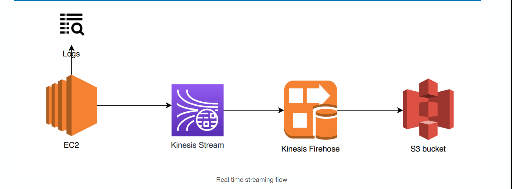

# Kinesis Data Stream 

You can install the agent on Linux-based server environments such as web servers, log servers, and database servers. After installing the agent, configure it by specifying the files to monitor and the delivery stream for the data. After the agent is configured, it durably collects data from the files and reliably sends it to the delivery stream with using Aws Cloudformation template.

- [Kinesis Data Stream Cloudformation Template](https://github.com/mehmetafsar510/aws_devops/blob/master/aws/projects/008-serverless/serveslessyaml.yml)

Steps to configure Kinesis Data Stream :-
1- Upload Kinesis Data Stream Cloudformation Template
2- Create a User role and give access to S3fullacces and Kinesisfullacces.
3- Configure agent_template.txt.
4- Upload agent_template.txt to your private S3 bucket.
5- Upload  city_temp_streaming_sample.log file from your GitHub repository.

