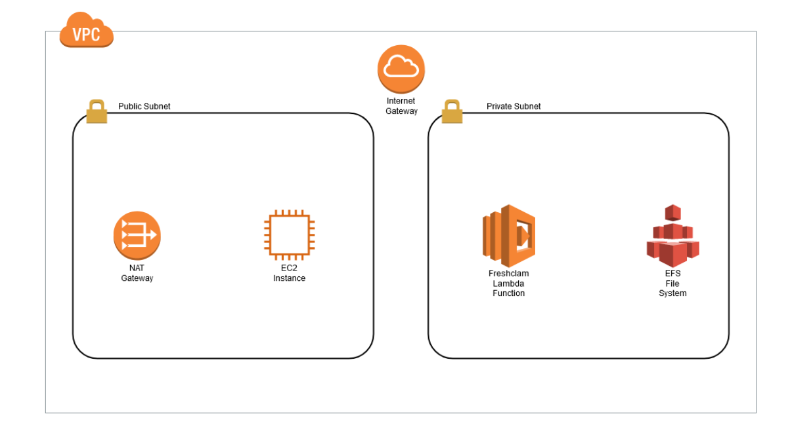

# Shared File System for Your Lambda Functions

You will get experience of working with VPC Based Lambda using an EFS File system using AWS Cloudformation Service.
- [Shared File System for Your Lambda Functions Cloudformation Template](https://github.com/mehmetafsar510/aws_devops/blob/master/aws/projects/015-Shared-File-System-for-Your-Lambda-Functions/VPC-EFS-LAMBDA.yaml)

  
EFS file system with a Lambda function, you use an EFS access point, an application-specific entry point into an EFS file system that includes the operating system user and group to use when accessing the file system, file system permissions, and can limit access to a specific path in the file system. This helps keeping file system configuration decoupled from the application code.
You can access the same EFS file system from multiple functions, using the same or different access points. For example, using different EFS access points, each Lambda function can access different paths in a file system, or use different file system permissions.

