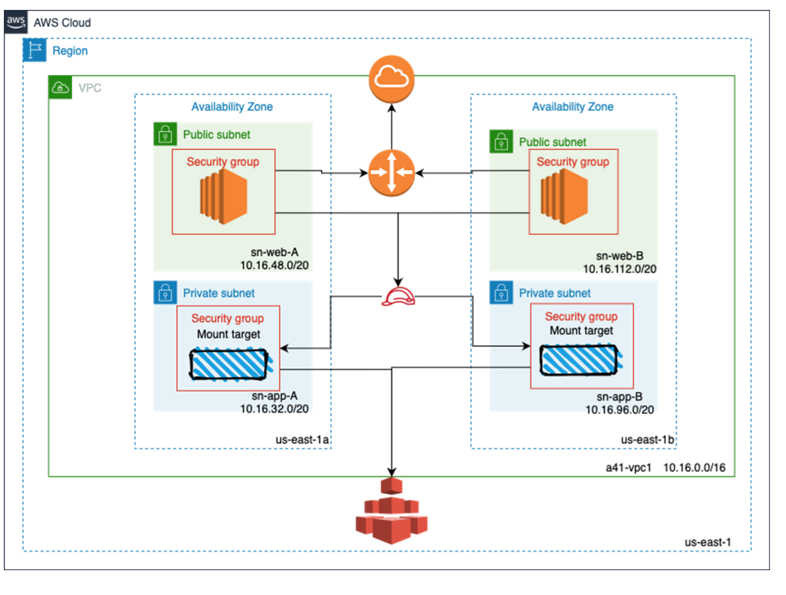

# EFS

You will implement a simple EFS architecture within an AWS VPC using AWS Cloudformation. 

 [EFS-Template](https://github.com/mehmetafsar510/aws_devops/blob/master/aws/projects/016-EFS/EFSson.yaml)  

  

