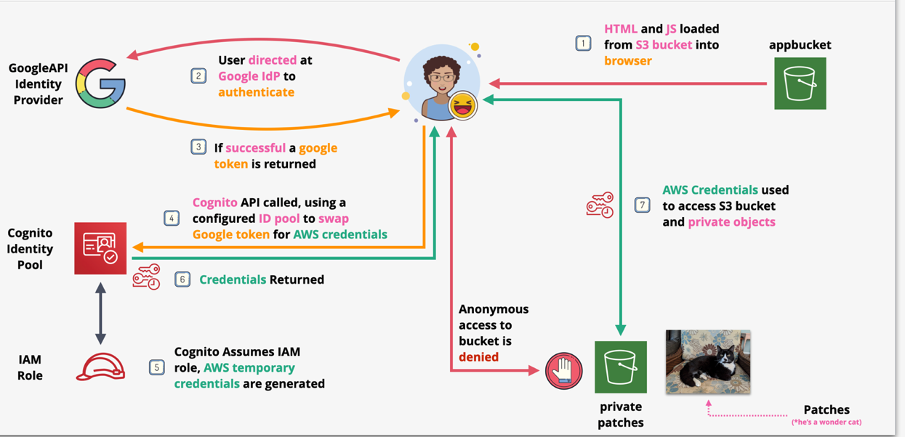

# Web Identity Federation

You will be implementing a simple serverless application which uses Web Identity Federation using AWS Cloudformation service.  
The application runs using the following technologies

- S3 for front-end application hosting
- Google API Project as an ID Provider
- Cognito and IAM Roles to swap Google Token for AWS credentials

The application runs from a browser, gets the user to login using a Google ID and then loads all images from a private S3 bucket into a browser using presignedURLs.

- [WEBIDF](https://github.com/mehmetafsar510/aws_devops/blob/master/aws/projects/017-Web-Identity-Federation/WebIdentityFederation.yaml)

#  Login to an AWS Account    

Login to an AWS account using a user with admin privileges and ensure your region is set to `us-east-1` `N. Virginia`  
Upload this template [WEBIDF](https://github.com/mehmetafsar510/aws_devops/blob/master/aws/projects/017-Web-Identity-Federation/WebIdentityFederation.yaml) to AWS cloudformation service. 
Check the  `The following resource(s) require capabilities: [AWS::IAM::ManagedPolicy, AWS::IAM::Role]` box  
Click `Create Stack`  

Wait for the STACK to move into the `CREATE_COMPLETE` state before continuing. 

#  Update files with your specific connection information  

Open the local copy of `index.html` in a code editor.    
Locate the `XXXXXXXXXX-XXXXXXXXXXXXXXXXXXXXXXXXXXXXXXXXX.apps.googleusercontent.com` placeholder   
Replace this with YOUR CLIENT ID  
Save `index.html`  

Open the local copy of `scripts.js` in a code editor.   
Locate the IdentityPoolId: `IdentityPoolId: 'XX-XXXX-X:XXXXXXXX-XXXX-XXXX-XXXX-XXXXXXXXXXXX'` placeholder    
Replace the `XXXXX` part with your IDENTITY POOL ID you noted down in the previous step  
Locate the `Bucket: "REPLACE_ME_PRIVATE_PATCHES_BUCKET" ` placeholder.  
Replace `REPLACE_ME_PRIVATE_PATCHES_BUCKET` with with bucket name of the `webidf-patchesprivatebucket-` bucket
Save `scripts.js`  

#  Upload files

Back on the S3 console, inside the `webidf-appbucket-` bucket.   
Click `Upload`    
Add the `index.html` and `scripts.js` files and click `Upload`    
Upload the patchesprivatebucket folder to the `patchesprivatebucket` bucket.

#  Test application  

Open the S3 bucket static hosting endpoint which you noted down earlier for the `webidf-appbucket` bucket  
This should have been noted down as `APP BUCKET ENDPOINT`  
it should show a simple webpage  
Click `Sign In`    
Sign in with your google account  

When you click the Sign In button a few things happen:-  

- You authenticate with the Google IDP  
- a Google Access token is returned  
- This token is provided as part of the API Call to Cognito  
- If successful this returns Temporary AWS credentials  
- These are used to list objects in the private bucket  
- for all objects, presignedURLs are generated and used to load the images in the browser.  

Once signed in you should see 3 cat pictures loaded from a private S3 bucket  

Click on each of them, notice the URL which is used? it's a presignedURL generated by the JS running in browser, using the API's which you can access using the cognito credentials.  

All of this is done with no self-managed compute.

#  FINISH  

At this point you have a fully functional simple serverless application, complete with :-

- template front end app bucket
- Configured Google API Project
- Credentials to access it
- Cognito ID Pool
- IAM Roles for the ID Pool
- HTML and JS configured to access the Google IDP and Cognito

