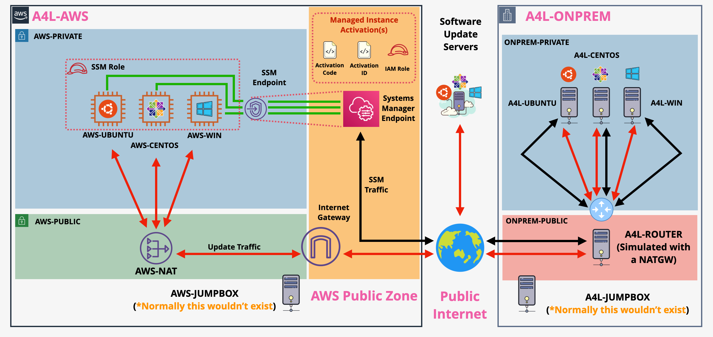

# Systems Manager in a Hybrid Environment (with a focus on patch manager)

You will get the chance to experience AWS Systems Manager. 
The demo simulates a Hybrid AWS and On-premises environment - both using AWS Cloudformation service .  

- [Systems Manager Cloudformation Template](https://github.com/mehmetafsar510/aws_devops/blob/master/aws/projects/018-System%20Manager/PatchManagerBase.yaml)

## Run Command
First Run the Hybridactivator Cli command(sure Role is the same path with your local Key) After that configure system paramater store or use bastion host make it manual.
## Click Installs
Make sure you are logged into AWS and in `us-east-1`  
Apply the first template and THEN once the first is in `CREATE_COMPLETE` the second

- [Base Infrastructure](https://github.com/mehmetafsar510/aws_devops/blob/master/aws/projects/018-System%20Manager/PatchManagerBase.yaml)
- [VPCe](https://github.com/mehmetafsar510/aws_devops/blob/master/aws/projects/018-System%20Manager/PatchManagerVPCEndpointsandRole.yaml)

# VERIFY PATCHING  

Wait for one of the maintanance windows to finish  
Open the maintanamce windows console  
https://console.aws.amazon.com/systems-manager/maintenance-windows/?region=us-east-1  

Click the `Windows` window  
Check `Next execution time`  
Wait for that time _note that its in UTC_  

Click on the `History` tab  
Select the item in history  
CLick `View Details`  
Select the Task Invocation ... click `view details`  
Pick one of the instanceID's, select it, click `view output`  
Expand output ....  
Verify that the process is working as expected  

#  CLEANUP  

Click `Hybrid Actvations`, selecet it, Click `Delete`, Click `Delete Activations`  

open `Managed Instances` https://console.aws.amazon.com/systems-manager/managed-instances?region=us-east-1  
Select each of the items starting with `mi-` clcik actions => `Deregister this managed instances`, then `Deregister`  

Open CloudFormation  
https://console.aws.amazon.com/cloudformation/home?region=us-east-1#/stacks?filteringText=&filteringStatus=active&viewNested=true&hideStacks=false  
Select SSMVPCE stack, Click `Delete`, then `Delete Stack`   
Wait for this to finish deleting  
Select SSMBASE stack, Click `Delete`, then `Delete Stack`  

