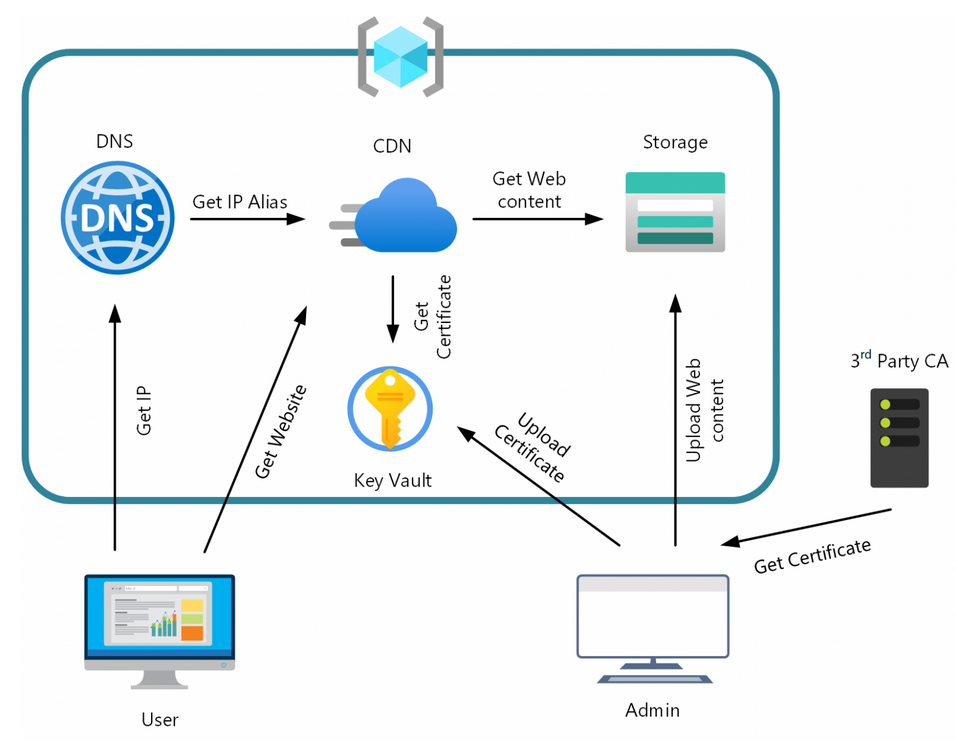

# Project-204 : Migrating a Static Site to Azure with Terraform

## Description

My goal is to migrate an existing site with the following properties:

  - host a static site at a custom domain (e.g. mehmetafsar.com);
    ensure that the site can be be served over https;
    force redirection from http to https;
    ensure that both the apex domain (mehmetafsar.com) and the www subdomain both work over https;

- To make everything work, we’re going to proceed with these steps with Terraform

    Set up tools and accounts;
    Set up an Azure Storage Account for a static site;
    Set up an Azure CDN to terminate TLS and handle http to https redirection;
    Set up an Azure DNS zone;
    Set up an Azure Key Vault and generate an x509 certificate;
    Sign the certificate and configure the CDN to use it; 

