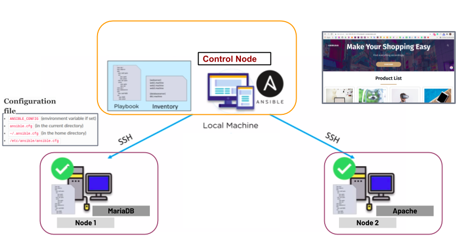

# Provisioning a Web Server and a Database Server with a Dynamic Website Using Ansible

The purpose of this project is to give you the knowledge of provisioning a web and database server with a dynamic website.

## Learning Outcomes

At the end of this project, you will be able to;

- Explain how to provision a web server using Ansible
- Explain how to provision a database server using Ansible

- [Ansible Playbook](https://github.com/mehmetafsar510/aws_devops/blob/master/devops/projects/204-Ansible-Website-Project/playbook.yml)

## Outline

- Part 1 - Build the Infrastructure (3 EC2 Instances with Red Hat Enterprise Linux 8 AMI)

- Part 2 - Install Ansible on the Controller Node

- Part 3 - Pinging the Target Nodes

- Part 4 - Install, Start and Enable MariaDB 

- Part 5 - Configure User Credentials and Database Schema

- Part 6 - Install, Start and Enable Apache Web Server and Other Dependencies

- Part 7 - Pull the Code and Make Necessary Changes

